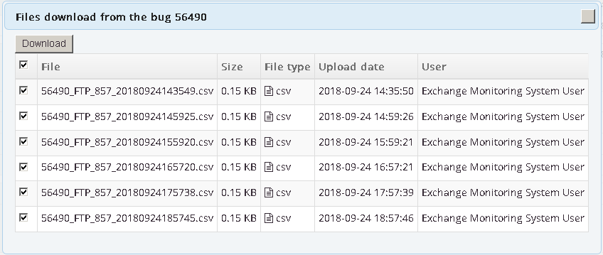

# DownloadFiles

## Overview ##
Mantis plugin: adds to the bug the ability to download selected files in one archive

## Screenshots ##

## Requirements

The plugin requires 

  * [MantisBT](http://mantisbt.org/) version 2.2 or higher
  * [jQueryUI plugin](https://github.com/mantisbt-plugins/jQuery-UI) 
    version 1.8 or higher

## Info ##
- Multi language support
- Inspired by [issue#12297](https://www.mantisbt.org/bugs/view.php?id=12297)

## Download ##
[Current version 1.0.1](https://github.com/AnatolyKabakov1983/DownloadFiles/releases/download/1.0.0/DownloadFiles-v1.0.0.zip)

## Installation ##
Copy the "`DownloadFiles`" folder in your plugin directory and open the plugin management page in your Mantis installation.
Click "Install" to complete the installation.

## Configuration ##
Nothing to configure.

## License ##
Released under the terms of the GNU General Public License v3 (GPLv3).

## Support ##
 * Any feedback is greatly appreciated!
